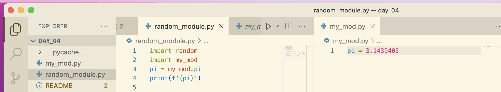

# Lists

## random module

## What is a module

to create modules, just add a new file, to be able to use it you can just import it



## Convert a String to a list

<https://www.askpython.com/python/string/convert-string-to-list-in-python>

```python
names = names.split(', ')
```

1. String to List of Strings

```python
#given string
string1="Python is great"
 
#printing the string
print("Actual String: ",string1) 
   
#gives us the type of string1
print("Type of string: ",type(string1))  
 
print("String coverted to list :",string1.split()) 
#prints the list given by split()
```

### Common Errors with Lists

"index out of range error"

remember list indexing starts at 0 so you can do
len(list)-1 to get the actual length

### Nested Lists

```python
fruits = ['strawberries', 'nectarines', 'apples', 'peaches', 'cherries']

vegetables = ['spinach', 'kale', 'tomatoes', 'celery', 'potatoes']

dirty_dozen = [fruits, vegetables]

dirty_dozen[1][1] #to get kale
```

### Index out of range error

meaning it is beyond the length of lists

### Error -> List indices must be integers or slices not strings (need to convert to integer first)
